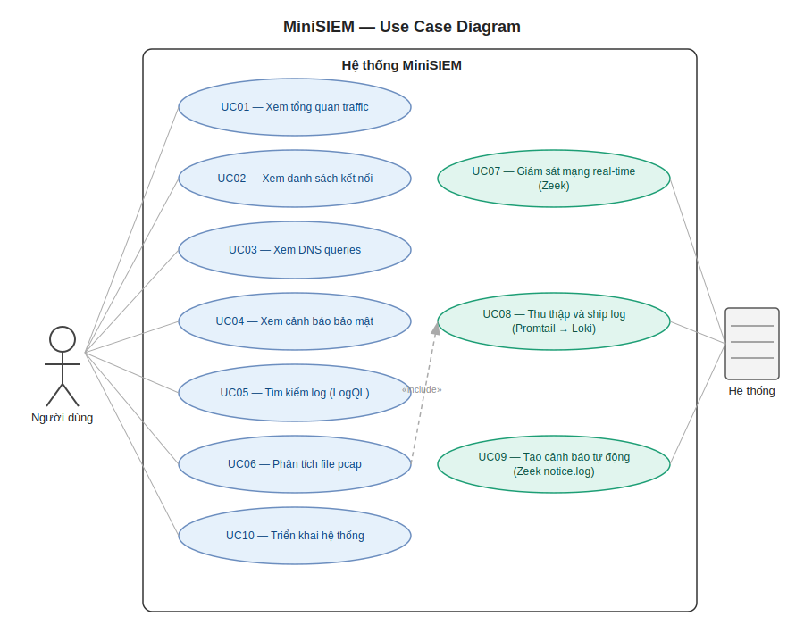

# Đặc tả Use Case — Tuần 4

## 1. Use Case Diagram

## 2. Danh sách Use Case

| ID | Tên Use Case | Actor | Yêu cầu |
|---|---|---|---|
| UC01 | Cài đặt Wazuh Agent | Người dùng | F01 |
| UC02 | Xem Security Overview | Người dùng | F05 |
| UC03 | Xem và điều tra alerts | Người dùng | F03 |
| UC04 | Xem danh sách agents | Người dùng | F06 |
| UC05 | Xem vulnerability report | Người dùng | F07 |
| UC06 | Phân tích file pcap | Người dùng | F09 |
| UC07 | Triển khai server stack | Người dùng | F10 |
| UC08 | Agent thu thập log real-time | Hệ thống | F01, F02 |
| UC09 | Suricata detect network threats | Hệ thống | F04 |
| UC10 | Manager tạo alerts tự động | Hệ thống | F03 |

## 3. Đặc tả chi tiết

### UC01 — Cài đặt Wazuh Agent
| Trường | Nội dung |
|---|---|
| Actor | Người dùng |
| Điều kiện tiên quyết | Wazuh Manager đang chạy, có IP Manager |
| Luồng chính | 1. Người dùng mở Wazuh Dashboard → Agents → Deploy |
| | 2. Chọn OS (Windows/Linux) |
| | 3. Copy lệnh cài đặt được generate |
| | 4. Chạy lệnh trên endpoint với quyền admin |
| | 5. Agent tự động kết nối về Manager |
| Kết quả | Agent hiển thị Active trên Dashboard |

### UC02 — Xem Security Overview
| Trường | Nội dung |
|---|---|
| Actor | Người dùng |
| Điều kiện tiên quyết | Ít nhất 1 agent đang kết nối |
| Luồng chính | 1. Mở Wazuh Dashboard (https://localhost) |
| | 2. Dashboard hiển thị: tổng alerts, top agents, top rules |
| | 3. Timeline của security events |
| | 4. Phân loại theo severity level |
| Kết quả | Người dùng nắm được tình trạng bảo mật tổng quan |

### UC03 — Xem và điều tra alerts
| Trường | Nội dung |
|---|---|
| Actor | Người dùng |
| Điều kiện tiên quyết | Có alerts trong hệ thống |
| Luồng chính | 1. Mở Security Events module |
| | 2. Filter theo agent, severity, rule group, thời gian |
| | 3. Click vào alert để xem chi tiết |
| | 4. Xem full_log, rule info, agent info |
| Kết quả | Người dùng điều tra được nguồn gốc sự kiện |

### UC04 — Xem danh sách agents
| Trường | Nội dung |
|---|---|
| Actor | Người dùng |
| Điều kiện tiên quyết | Có agents đã cài đặt |
| Luồng chính | 1. Mở Agents module |
| | 2. Xem danh sách: ID, name, IP, OS, status, last seen |
| | 3. Click vào agent để xem chi tiết events |
| Kết quả | Quản lý được tất cả endpoints đang giám sát |

### UC05 — Xem vulnerability report
| Trường | Nội dung |
|---|---|
| Actor | Người dùng |
| Điều kiện tiên quyết | Agent có bật vulnerability detection |
| Luồng chính | 1. Mở Vulnerability Detector module |
| | 2. Xem danh sách CVE theo agent |
| | 3. Phân loại: Critical/High/Medium/Low |
| Kết quả | Biết được lỗ hổng cần vá trên từng endpoint |

### UC06 — Phân tích file pcap
| Trường | Nội dung |
|---|---|
| Actor | Người dùng |
| Điều kiện tiên quyết | Suricata đã cài đặt, Wazuh Agent đang chạy |
| Luồng chính | 1. Chạy Suricata với flag -r và file pcap |
| | 2. Suricata tạo alerts vào eve.json |
| | 3. Wazuh Agent đọc eve.json |
| | 4. Alerts xuất hiện trên Dashboard |
| Kết quả | Phân tích được traffic trong file pcap |

### UC07 — Triển khai server stack
| Trường | Nội dung |
|---|---|
| Actor | Người dùng |
| Điều kiện tiên quyết | Ubuntu Server đã cài, clone curl về package của wazuh |
| Luồng chính | 1. Generate certificates |
| | 2. Chạy curl -sO https://packages.wazuh.com/4.14/wazuh-install.sh && sudo bash ./wazuh-install.sh –a |
| | 3. Đợi ~5 phút cho services khởi động |
| | 4. Truy cập https://<Wazuh-ip> |
| Kết quả | Wazuh Dashboard sẵn sàng sử dụng |

### UC08 — Agent thu thập log real-time
| Trường | Nội dung |
|---|---|
| Actor | Hệ thống |
| Điều kiện tiên quyết | Wazuh Agent đang chạy (WazuhSvc) |
| Luồng chính | 1. Agent liên tục đọc Windows Event Log/syslog |
| | 2. Encrypt và gửi về Manager qua TLS |
| | 3. Manager phân tích và so khớp rules |
| | 4. Tạo alert nếu match rule |
| Kết quả | Log được ship real-time, alert < 30 giây |

### UC09 — Suricata detect network threats
| Trường | Nội dung |
|---|---|
| Actor | Hệ thống |
| Điều kiện tiên quyết | Suricata đang chạy, ET rules được update |
| Luồng chính | 1. Suricata lắng nghe trên network interface |
| | 2. So khớp traffic với Emerging Threats rules |
| | 3. Ghi alert vào eve.json |
| | 4. Wazuh Agent đọc và ship về Manager |
| Kết quả | Network threats hiển thị trên Dashboard |

### UC10 — Manager tạo alerts tự động
| Trường | Nội dung |
|---|---|
| Actor | Hệ thống |
| Điều kiện tiên quyết | Manager nhận log từ agents |
| Luồng chính | 1. Manager nhận log event |
| | 2. Áp dụng decoder để parse log |
| | 3. So khớp với rules database |
| | 4. Nếu match: tạo alert với level và description |
| | 5. Lưu vào Indexer, hiển thị trên Dashboard |
| Kết quả | Alert xuất hiện real-time trên Dashboard |

## 4. Tiêu chuẩn đánh giá

| Tiêu chí | Mức đạt | Mức tốt |
|---|---|---|
| Server deployment | Ubuntu Server hoạt động | Khởi động < 2 phút / Cài đặt < 10 phút | 
| Agent connection | Agent kết nối Manager | < 30 giây |
| Real-time alert | < 60 giây | < 30 giây |
| Suricata detection | Port scan detected | Full ET ruleset |
| Dashboard | Events + agents | Auto-refresh |
| RAM | < 8GB | < 6GB |

