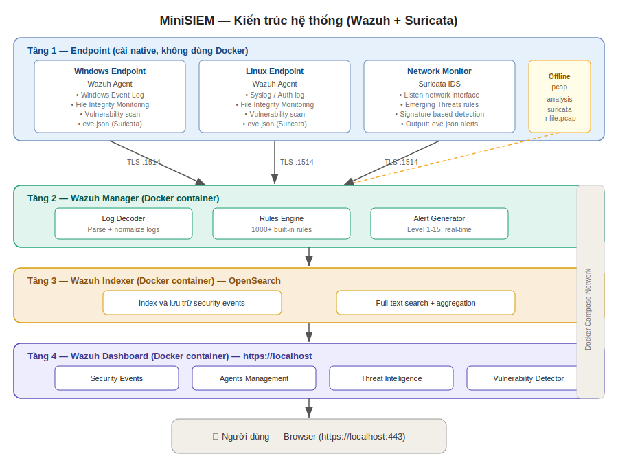

# Thiết kế hệ thống — Tuần 5

## 1. Kiến trúc tổng thể



## 2. Data Flow

Internet/LAN traffic
↓
[Zeek container]

Lắng nghe eth0/wlan0
Phân tích từng packet
Output: /zeek/logs/current/*.log
↓
[Promtail container]
Theo dõi /zeek/logs/current/
Gắn labels: job="zeek", log_type="conn|dns|http..."
Push vào Loki API
↓
[Loki container]
Nhận log streams
Index theo labels
Lưu trữ dạng compressed chunks
↓
[Grafana container]
Datasource: Loki (http://loki:3100)
Query bằng LogQL
Render dashboards
↓
[Người dùng - Browser]
localhost:3000

## 3. Docker Network

Tất cả containers nằm trong một Docker network riêng:

minisiem_network (bridge)
├── zeek        (no exposed port - internal only)
├── promtail    (port 9080 - metrics)
├── loki        (port 3100 - internal)
└── grafana     (port 3000 - exposed to host)

Chỉ Grafana được expose ra host machine. Người dùng chỉ cần
truy cập `localhost:3000`.

## 4. Volume Mapping

```yaml
volumes:
  zeek_logs:     # Zeek logs → shared với Promtail
  loki_data:     # Loki storage (persistent)
  grafana_data:  # Grafana config và dashboards (persistent)
```

## 5. Zeek Log Schema

### conn.log (kết nối mạng)
| Field | Type | Mô tả |
|---|---|---|
| ts | timestamp | Thời gian bắt đầu kết nối |
| uid | string | Unique connection ID |
| id.orig_h | addr | IP nguồn |
| id.orig_p | port | Port nguồn |
| id.resp_h | addr | IP đích |
| id.resp_p | port | Port đích |
| proto | enum | tcp/udp/icmp |
| service | string | Dịch vụ phát hiện được |
| duration | interval | Thời lượng kết nối |
| orig_bytes | count | Bytes gửi |
| resp_bytes | count | Bytes nhận |
| conn_state | string | Trạng thái kết nối |

### dns.log (DNS queries)
| Field | Type | Mô tả |
|---|---|---|
| ts | timestamp | Thời gian query |
| uid | string | Connection ID |
| id.orig_h | addr | IP nguồn |
| query | string | Tên domain được query |
| qtype_name | string | Loại record (A, AAAA, MX…) |
| answers | array | Danh sách IP trả về |

### notice.log (cảnh báo Zeek)
| Field | Type | Mô tả |
|---|---|---|
| ts | timestamp | Thời gian cảnh báo |
| note | enum | Loại cảnh báo |
| msg | string | Mô tả chi tiết |
| src | addr | IP nguồn |
| dst | addr | IP đích |
| severity | string | Mức độ nghiêm trọng |

## 6. Grafana Dashboard Design

### Overview Dashboard

┌─────────────────────────────────────────────┐
│  🛡️ MiniSIEM — Security Overview            │
├──────────┬──────────┬──────────┬────────────┤
│ Kết nối  │  Alerts  │  DNS     │  Bytes     │
│  1,247   │    3     │  432     │  45.2 MB   │
├──────────┴──────────┴──────────┴────────────┤
│  [Traffic theo thời gian - Time series]     │
├─────────────────────┬───────────────────────┤
│ [Top 10 src IP]     │[Protocol distribution]│
└─────────────────────┴───────────────────────┘

### Security Alerts Dashboard

┌─────────────────────────────────────────────┐
│  🚨 Security Alerts                         │
├─────────────────────────────────────────────┤
│  [Alerts timeline - Time series]            │
├─────────────────────────────────────────────┤
│  Timestamp | Type | Src IP | Description    │
│  14:32:01  | Scan | 1.2.3.4| Port scan      │
│  14:31:55  | DNS  | 5.6.7.8| DNS tunneling  │
└─────────────────────────────────────────────┘

## 7. Tiêu chuẩn đánh giá sản phẩm

| Tiêu chí | Mức đạt | Mức tốt |
|---|---|---|
| Deploy | docker compose up hoạt động | Chạy < 60 giây |
| Zeek | Parse được pcap file | Real-time capture |
| Loki | Nhận và lưu log | Query < 2 giây |
| Grafana | 3 dashboard cơ bản | Auto-refresh 5s |
| RAM | < 512MB | < 256MB |
| Docs | README đầy đủ | Video demo |